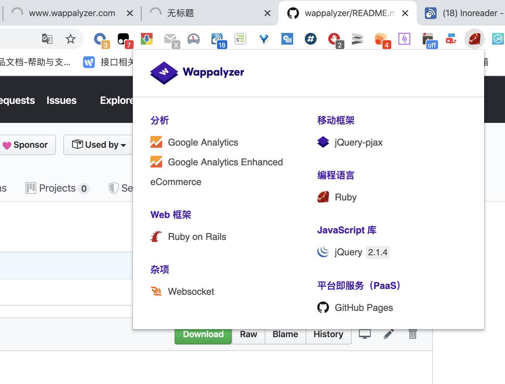

Wappalyzer 一个开源的跨平台工具用于检测网站使用什么技术

<!-- feature -->

可以检测使用的：
- 库、框架
- 服务器
- 编程语言
- CDN、分析工具

具有浏览器扩展、nodejs工具、网页（未开源）等几种形式

<!-- gallery -->

<!-- url -->

[office](https://www.wappalyzer.com/)

[github](https://github.com/AliasIO/wappalyzer)

[download](https://chrome.google.com/webstore/detail/wappalyzer/gppongmhjkpfnbhagpmjfkannfbllamg?utm_source=chrome-ntp-icon)