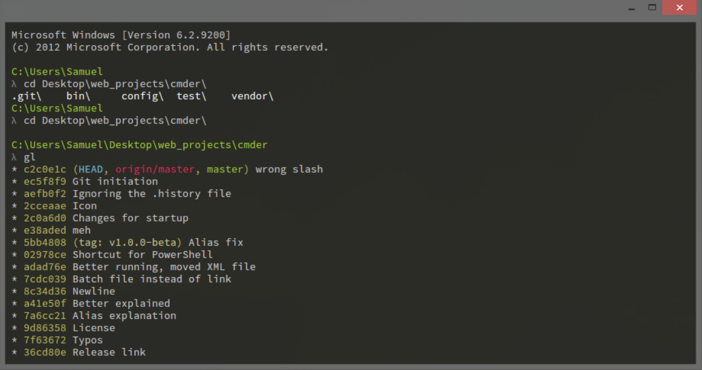

title: Cmder
tags:
    - Windows
---

为Windows缺失漂亮的终端界面而设计的(官方介绍)

__特性：__

- 透明背景支持
- Tab页显示终端支持
- 与windows一致的快捷键，复制Ctrl+C 黏贴Ctrl+V 撤销Ctrl+Z
...

<!-- expr -->

- 把 cmder 加到环境变量
可以把Cmder.exe存放的目录添加到系统环境变量；加完之后,Win+r一下输入cmder,即可。

- 添加 cmder 到右键菜单
在管理员权限的终端输入以下语句即可：`Cmder.exe /REGISTER ALL`。（注：需要先将cmder加到环境变量，否则要在cmder目录下才可执行正常）

<!-- gallery -->

